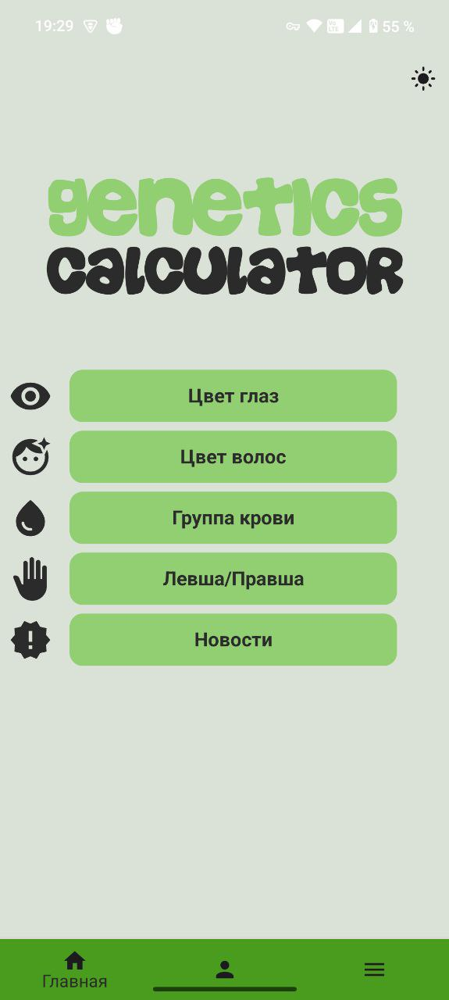
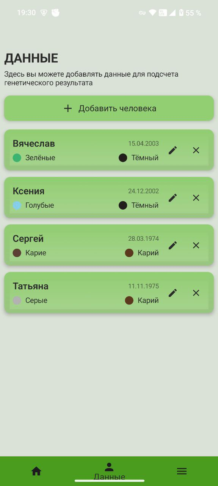
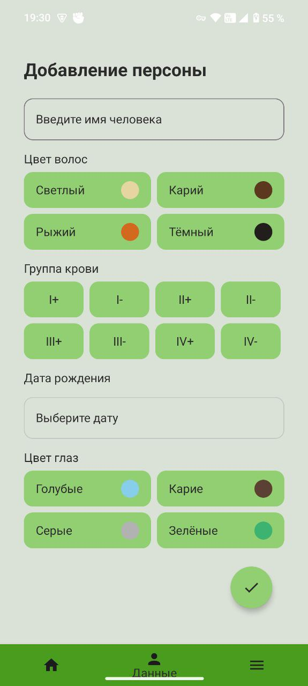

# 🌟 GConJC - Генетический Калькулятор

**GConJC** — это стильное и функциональное мобильное приложение для первичного генетического анализа и расчётов. Хотите узнать, как наследуются цвет глаз, волос или группа крови? 📊 GConJC поможет хранить данные, анализировать гены и следить за новостями генетики — всё в одном месте!

---

## 🚀 Что умеет GConJC?

✨ **Хранение данных о людях**:
- Имя
- Дата рождения
- Цвет волос
- Цвет глаз
- Группа крови

🔧 **Гибкое управление**:
- Добавляйте, редактируйте или удаляйте записи в пару кликов.

🧬 **Генетический анализ**:
- Рассчитывайте вероятность наследования признаков (цвет глаз, волос, группа крови, левша/правша).
- Используйте таблицу доминантных и рецессивных генов для точных прогнозов.

📰 **Новости генетики**:
- Будьте в курсе последних открытий прямо в приложении!

---

## 🎯 Для кого это?

- **Студенты и преподаватели** 📚, изучающие генетику.
- **Любители науки** 🧪, интересующиеся наследственностью.
- **Семьи** 👨‍👩‍👧, которые хотят разобраться в генах.

---

## 🛠 Установка

1. **Склонируйте репозиторий**:
   ```bash
   git clone https://github.com/NakaraT/GConJC.git
   ```
2. **Откройте проект в Android Studio**:
   - Убедитесь, что у вас установлена последняя версия Android Studio и настроен Kotlin.
3. **Установите зависимости**:
   ```bash
   ./gradlew build
   ```
4. **Запустите приложение**:
   - Подключите Android-устройство или эмулятор.
   - Нажмите "Run" в Android Studio.

---

## 📱 Как пользоваться

1. **Добавление человека**:
   - Перейдите в раздел "Добавить" ➕.
   - Введите данные: имя, дату рождения, цвет волос, глаз, группу крови.
2. **Анализ генов**:
   - Выберите людей из базы.
   - Используйте таблицу генов для расчёта вероятностей 🧮.
3. **Новости**:
   - Откройте вкладку "Новости" 📰 для свежих обновлений.
4. **Редактирование/Удаление**:
   - Найдите запись и выберите "Редактировать" ✏️ или "Удалить" 🗑.

---

## 🖼 Скриншоты

| Главный экран | Анализ генов | Данные |
|---------------|--------------|--------|
|  |  |  |

| Редактирование персоны | Таблица генов |
|-------------------------|---------------|
|  |  |


---

## 💻 Технологии

GConJC построен на современных инструментах Android-разработки:

- **Android Jetpack Compose** 🎨 — для создания интуитивного UI.
- **Kotlin Coroutines / Flow** 🌊 — для асинхронной обработки данных.
- **Room Database** 🗄 — для надёжного хранения информации.
- **SharedPreferences** ⚙️ — для сохранения настроек.
- **Material 3** 🖌 — для стильного дизайна.
- **Jetpack Navigation** 🧭 — для плавной навигации.
- **Jsoup** 🌐 — для парсинга новостей.
- **Hilt** 💉 — для внедрения зависимостей.

---

## 🌈 Планы на будущее

- 🧩 Добавить поддержку новых генетических признаков.
- 🎨 Улучшить UI/UX для ещё большего удобства.
- 🌐 Интегрировать API для автоматического обновления новостей.
- 📈 Добавить визуализацию данных (графики, диаграммы).

---

## 🤝 Контрибьютинг

Хотите сделать GConJC ещё круче? Присоединяйтесь! 🚀

1. Форкните репозиторий.
2. Создайте ветку (`git checkout -b feature/ваша-идея`).
3. Внесите изменения (`git commit -m "Добавлена 
